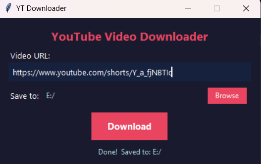

# ytgrab

Download any YouTube video or Short in the highest quality. Output is always MP4.



---

## Download

**[→ Download ytgrab.exe](https://github.com/tayademandar/ytgrab/releases/latest)**

Double-click it. That's all — no install, no setup.

---

## How to use

1. Paste a YouTube URL
2. Pick a folder (optional — defaults to Downloads)
3. Click **Download**

Works with regular videos and Shorts.

---

## For Python users

```bash
git clone https://github.com/tayademandar/ytgrab.git
cd ytgrab
pip install -r requirements.txt
python ytgrab.py
```

---

## License

MIT
